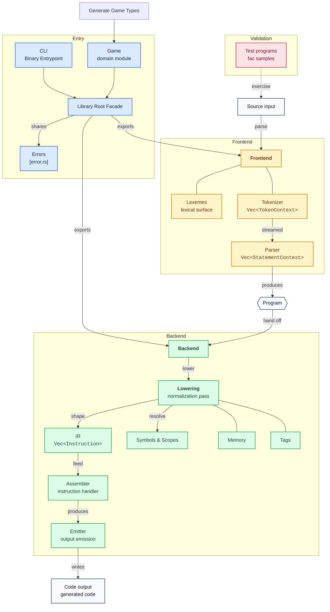

# FFC

```mermaid
flowchart TD

node_game_domain_generator["Generate Game Types"]
node_game_domain_generator --> node_game_mod

subgraph group_entry["Entry"]
  node_main_rs["CLI<br/>Binary Entrypoint<br/>"]
  node_lib_root["Library Root Facade"]
  node_error_mod["Errors<br/>[error.rs]"]
  node_game_mod["Game<br/>domain module"]
end 

subgraph group_frontend["Frontend"]
  node_frontend_mod["<b>Frontend</b>"]
  node_lexemes_mod["Lexemes<br/>lexical surface"]
  node_tokenizer_mod["Tokenizer<br/><code>Vec&lt;TokenContext&gt;</code>"]
  node_parser_mod["Parser<br/><code>Vec&lt;StatementContext&gt;</code>"]
end

node_frontend_mod --- node_tokenizer_mod
node_tokenizer_mod -->|"streamed"| node_parser_mod
node_frontend_mod --- node_lexemes_mod


click node_tokenizer_mod "github.com/theunrealtarik/fcpu/blob/8bfa39349154767a7432e99ba4fbecc02cd439ff/src/lib/frontend/token.rs#L25"

class node_frontend_mod,node_lexemes_mod,node_token_mod,node_ast_mod,node_parser_mod,node_tokenizer_mod toneAmber


subgraph group_backend["Backend"]
  node_backend_mod["<b>Backend</b>"]
  node_low_mod["<b>Lowering</b><br/>normalization pass"]
  node_ir_mod["IR<br/><code>Vec&lt;Instruction&gt;</code>"]
  node_symbol_mod["Symbols & Scopes"]
  node_mem_mod["Memory"]
  node_tags_mod["Tags"]
  node_asm_mod["Assembler<br/>instruction handler"]
  node_emit_mod["Emitter<br/>output emission"]
end

node_asm_mod -->|"produces"| node_emit_mod

node_low_mod -->|"resolve"| node_symbol_mod
node_low_mod --- node_mem_mod
node_low_mod --- node_tags_mod

subgraph group_validation["Validation"]
  node_tests["Test programs<br/>fac samples"]
end

node_source_input["Source input"]
node_program_model{{"Program"}}
node_code_output["Code output<br/>generated code"]

node_source_input -->|"parse"| node_frontend_mod

node_parser_mod -->|"produces"| node_program_model
node_main_rs --> node_lib_root
node_lib_root -->|"exports"| node_frontend_mod
node_lib_root -->|"exports"| node_backend_mod
node_lib_root -->|"shares"| node_error_mod
node_backend_mod -->|"lower"| node_low_mod
node_low_mod -->|"shape"| node_ir_mod
node_ir_mod -->|"feed"| node_asm_mod

node_emit_mod -->|"writes"| node_code_output
node_program_model -->|"hand off"| node_backend_mod
node_tests -.->|"exercise"| node_source_input
node_game_mod --> node_lib_root


click node_main_rs "https://github.com/theunrealtarik/fcpu/blob/master/src/main.rs"
click node_lib_root "https://github.com/theunrealtarik/fcpu/blob/master/src/lib/mod.rs"
click node_error_mod "https://github.com/theunrealtarik/fcpu/blob/master/src/lib/error.rs"
click node_frontend_mod "https://github.com/theunrealtarik/fcpu/blob/master/src/lib/frontend/mod.rs"
click node_lexemes_mod "https://github.com/theunrealtarik/fcpu/blob/master/src/lib/frontend/lexemes.rs"
click node_token_mod "https://github.com/theunrealtarik/fcpu/blob/master/src/lib/frontend/token.rs"
click node_ast_mod "https://github.com/theunrealtarik/fcpu/blob/master/src/lib/frontend/ast.rs"
click node_parser_mod "https://github.com/theunrealtarik/fcpu/blob/master/src/lib/frontend/parser.rs"
click node_backend_mod "https://github.com/theunrealtarik/fcpu/blob/master/src/lib/backend/mod.rs"
click node_ir_mod "https://github.com/theunrealtarik/fcpu/blob/master/src/lib/backend/ir.rs"
click node_low_mod "https://github.com/theunrealtarik/fcpu/blob/master/src/lib/backend/low.rs"
click node_mem_mod "https://github.com/theunrealtarik/fcpu/blob/master/src/lib/backend/mem.rs"
click node_symbol_mod "https://github.com/theunrealtarik/fcpu/blob/master/src/lib/backend/symbol.rs"
click node_tags_mod "https://github.com/theunrealtarik/fcpu/blob/master/src/lib/backend/tags.rs"
click node_asm_mod "https://github.com/theunrealtarik/fcpu/blob/master/src/lib/backend/asm.rs"
click node_emit_mod "https://github.com/theunrealtarik/fcpu/blob/master/src/lib/backend/emit.rs"
click node_game_mod "https://github.com/theunrealtarik/fcpu/blob/master/src/lib/game/mod.rs"

classDef toneNeutral fill:#f8fafc,stroke:#334155,stroke-width:1.5px,color:#0f172a
classDef toneBlue fill:#dbeafe,stroke:#2563eb,stroke-width:1.5px,color:#172554
classDef toneAmber fill:#fef3c7,stroke:#d97706,stroke-width:1.5px,color:#78350f
classDef toneMint fill:#dcfce7,stroke:#16a34a,stroke-width:1.5px,color:#14532d
classDef toneRose fill:#ffe4e6,stroke:#e11d48,stroke-width:1.5px,color:#881337
classDef toneIndigo fill:#e0e7ff,stroke:#4f46e5,stroke-width:1.5px,color:#312e81
classDef toneTeal fill:#ccfbf1,stroke:#0f766e,stroke-width:1.5px,color:#134e4a

class node_main_rs,node_lib_root,node_error_mod,node_game_mod toneBlue
class node_backend_mod,node_ir_mod,node_low_mod,node_mem_mod,node_symbol_mod,node_tags_mod,node_asm_mod,node_emit_mod toneMint
class node_tests toneRose
class node_source_input,node_program_model,node_instruction_stream,node_code_output toneNeutral
```
